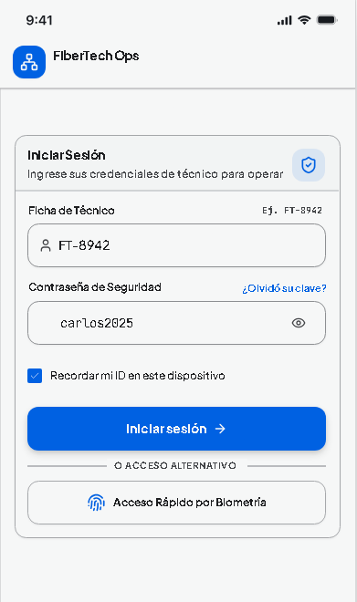
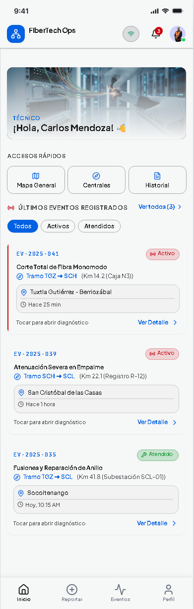
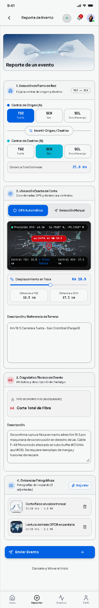
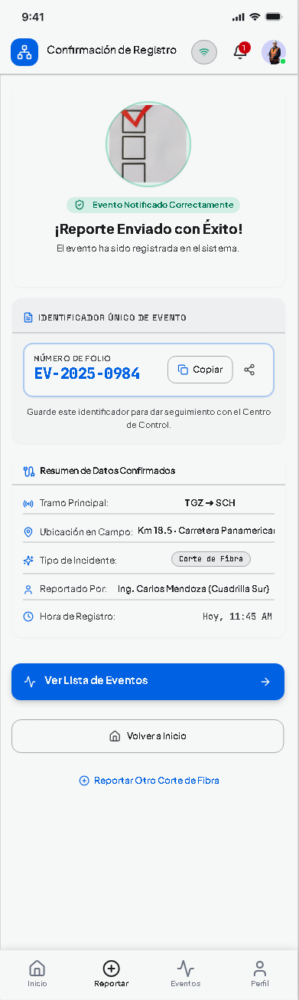
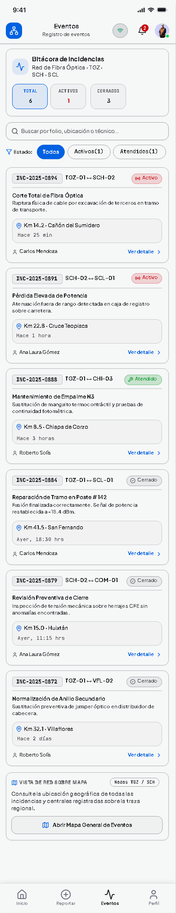
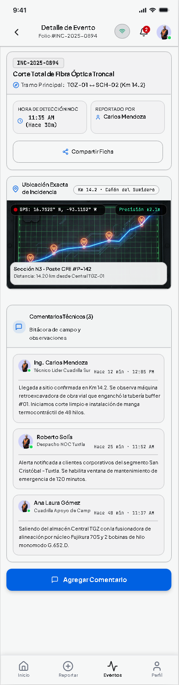
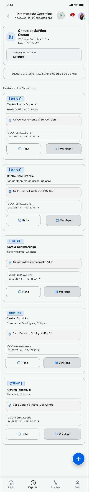
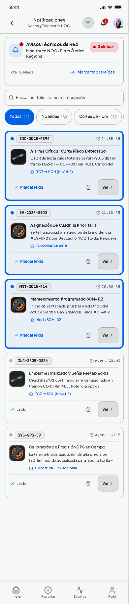
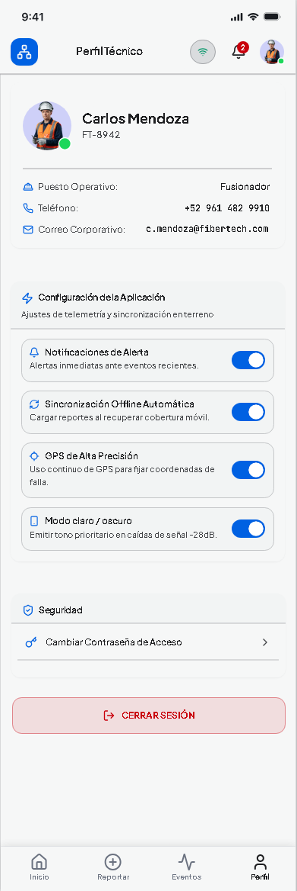

# Maquetado

## Login

- Ficha de Técnico, Contraseña, Recordar dispositivo.
- Acceso Rápido por Biometría (condicional).
- ¿Olvidó su clave?

## Home

- Saludo con nombre, accesos rápidos (Mapa General, Centrales, Historial).
- Últimos eventos con filtros (Todos / Activos / Atendidos).

## Reportar Evento

- Paso 1: Selección de Tramo de Red (Origen/Destino).
- Paso 2: Ubicación (GPS/Manual, mapa interactivo).
- Paso 3: Diagnóstico Técnico (descripción).
- Paso 4: Evidencias Fotográficas.

## Confirmación de Registro

- Folio, resumen del tramo, ubicación, hora de registro.
- Acciones: Ver Lista de Eventos / Volver a Inicio / Reportar Otro Corte.

## Eventos

- Lista con filtros por estado.
- Tarjeta de evento: folio, tramo, ubicación, tiempo, estado.

## Detalle de Evento

- Info del evento, galería de fotos, hilo de comentarios, cambio de estado.

## Centrales

- Directorio de centrales: listar, crear, editar, eliminar.

## Notificaciones

- Historial con estado leído/no leído.

## Perfil / Completar Perfil

- Foto de perfil, nombre, correo, puesto de trabajo.
- Configuración de la aplicación, seguridad, cerrar sesión.

---